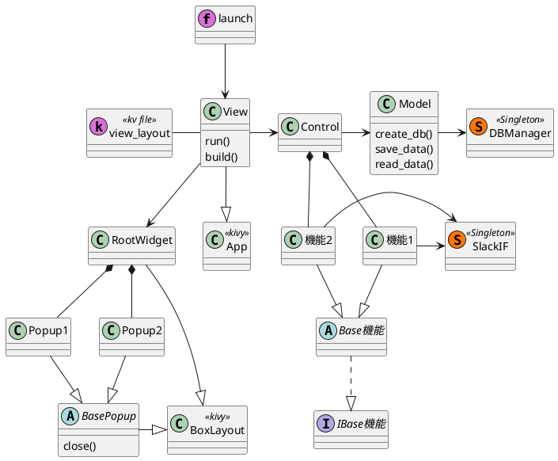

# 基本設計書

<div style="text-align:right">作成日 2023 年 1 月 1 日</div>

---

- [基本設計書](#基本設計書)
  - [1. アーキテクチャ](#1-アーキテクチャ)
  - [2. クラス図](#2-クラス図)
  - [3. Slack Token の暗号化](#3-slack-token-の暗号化)
    - [3.1. 暗号化](#31-暗号化)
    - [3.2. 復号化](#32-復号化)

---

## 1. アーキテクチャ


## 2. クラス図



## 3. Slack Token の暗号化

### 3.1. 暗号化

```python
from Crypto.Cipher import AES

# 半角16文字
key = b"****************"
# 暗号化対象
target = b"{SLACK_TOKEN}"

cipher = AES.new(key, AES.MODE_EAX)
ciphertext, tag = cipher.encrypt_and_digest(target)
nonce = cipher.nonce

# cripto_token.datにバイナリ書き込み
with open("cripto_token.dat", "wb") as f:
    for text in (nonce, tag, ciphertext):
        f.write(text)
```

### 3.2. 復号化

```python
from Crypto.Cipher import AES

# 暗号化の時のキー
key = b"****************"

# 暗号化ファイルの読み込み
with open("cripto_token.dat", "rb") as f:
    nonce2, tag2, ciphertext2 = [
        f.read(x) for x in (AES.block_size, AES.block_size, -1)
    ]

cipher2 = AES.new(key, AES.MODE_EAX, nonce2)
decrypted_text = cipher2.decrypt(ciphertext2)

print(decrypted_text.decode())
```
