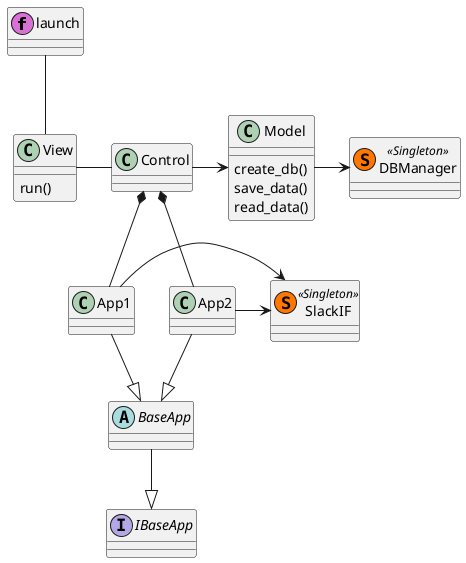

# 基本設計書

作成日 2023 年 1 月 1 日

---

- [基本設計書](#基本設計書)
  - [1. アーキテクチャ](#1-アーキテクチャ)
  - [2. クラス図](#2-クラス図)

---

## 1. アーキテクチャ

## 2. クラス図

```plantuml
@startuml

class launch <<(f,orchid)>>
class View {
    run()
}
class Control {
}
class Model {
    create_db()
    save_data()
    read_data()
}
class DBManager <<(S,#FF7700) Singleton>>{
}
class SlackIF <<(S,#FF7700) Singleton>>{
}
abstract BaseApp
interface IBaseApp

launch -- View
View - Control
Control -> Model
Control *-- App1
Control *-- App2
Model -> DBManager
App1 --|> BaseApp
App2 --|> BaseApp
App1 -> SlackIF
App2 -> SlackIF
BaseApp --|> IBaseApp

@enduml
```
